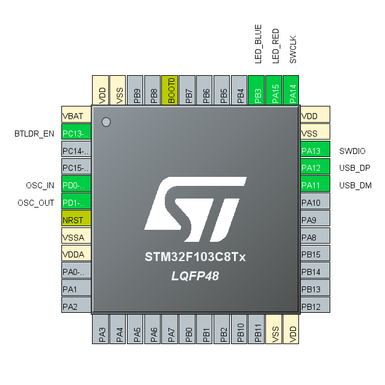

# LaserMaster Mass Storage Device Bootloader
Device: STM32F103C8Tx
Flash size: 64 kBytes

| Name | STM32F103C8T6 Address |
| --- | --- |
| Appcode: | 0x0800_4000 - 0x0800_FFFF  (48 kB) |
| Bootloader | 0x0800_0000 - 0x0800_3FFF (16 kB)  |

#### Pinout:



### General description:

This fork is modified to run on the Laser Master hardware.

Simulate a USB removable disk (FAT32).

Just drag and drop the intel hex file to update the appcode. The bootloader will automatically restart if EOF RecordType is found in the intel hex file. <b>Drag and drop the BIN file is removed.</b> Since intel hex file has the following advantages over the bin file:

1. Most of the compiler tools support direct export to intel hex file. No need to covert to bin file anymore.
2. Provides better integrity check.
3. macOS works properly because of unique format in intel hex file.

During power up, the bootloader will check the content of 0x0800_4000 exists or not.
Hold **PC13** (Connect to GND) during power up can force to *enter* bootloader mode.

#### USB Drive tested with following operating systems: 
- [x] Windows 8
- [x] Windows 7
- [x] MacOS Sierra
- [x] Ubuntu 18.04
- [x] Windows 10

### Test Procedure:
1. Hold **PC13** during power up to enter bootloader mode.
2. Red (PA15) and blue led (PC3) will flash fast. A removable disk drive named `BOOTLOADER` is recognized.
3. Ensure **PC13** is released.
4. Drag and drop `firmware.hex` to the removable disk.
5. Red and blue led glow continuously during flash process.
6. Since the intel hex file contains EOF record type, the bootloader will restart at the end.
7. The bootloader jumps to appcode.

### Features:
The following features are currently configured in `btldr_config.h`

```c
#define CONFIG_SUPPORT_CRYPT_MODE           0u
#define CONFIG_READ_FLASH                   1u
#define CONFIG_SOFT_RESET_AFTER_IHEX_EOF    1u

#define BTLDR_ACT_ButtonPress               1u
#define BTLDR_ACT_NoAppExist                1u
#define BTLDR_ACT_CksNotVld                 1u
#define BTLDR_ACT_BootkeyDet                0u
```

#### CRC32 Checksum verification:
Before bootloader jumps to main application, it calculates the app's CRC32 checksum and compares it to the CRC32 calculated at build time (which is stored at end of flash). Jump to app is only performed in case of valid checksum.

#### CRC32 Tools:

Use `tools\crc-calc\bin2hex_with_crc32_48k.bat` to generate hex file from original binary file (CRC checksum is placed at last 32bit block of flash). 

